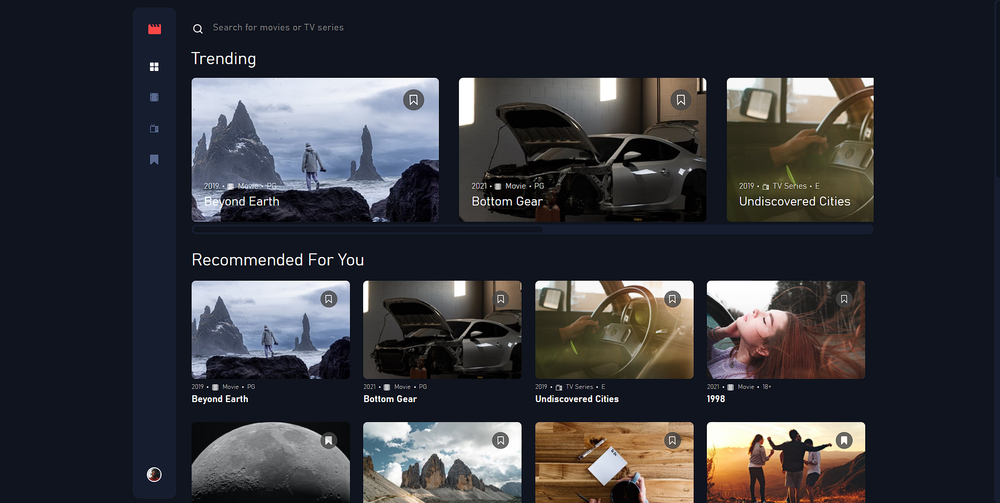

# Entertainment web app

This is a solution to the [Entertainment web app challenge on Frontend Mentor](https://www.frontendmentor.io/challenges/entertainment-web-app-J-UhgAW1X).

## :beginner: Overview

[View demo](https://davitjabushanuri.github.io/entertainment-web-app/)

## :camera:



## :zap: Usage

Users should be able to:

- View the optimal layout for the app depending on their device's screen size
- See hover states for all interactive elements on the page
- Navigate between Home, Movies, TV Series, and Bookmarked Shows pages
- Add/Remove bookmarks from all movies and TV series
- Search for relevant shows on all pages

### :notebook: Pre-Requisites

To get a local copy up and running follow these simple example steps.

- [git](https://git-scm.com/)
- [NodeJS](https://nodejs.dev/)
- [npm](https://npmjscom/)

### :electric_plug: Installation

After you've made sure to have all the tools installed, you should be able to just run a few commands to get set up

```
git clone https://github.com/davitJabushanuri/entertainment-web-app.git
cd entertainment-web-app
npm install
npm start
```

### :hammer: Built With

- [React](reactjs.org)
- [React Router](https://reactrouter.com/)
- [SCSS](https://sass-lang.com/)
- [Css Grid](https://css-tricks.com/snippets/css/complete-guide-grid/)
- [Flexbox](https://css-tricks.com/snippets/css/a-guide-to-flexbox/)

## :book: What I learned

- CSS Variable Naming

  ```
  // colors
  $clr-base: #ffffff;
  $clr-primary: #fc4747;
  $clr-secondary: #161d2f;
  $clr-background: #10141e;

  // font size
  $fs-base: 16px;
  $fs-h1: 32px;
  $fs-h2: 24px;
  $fs-micro: 13px;

  // font family
  $ff-base: 'Outfit', sans-serif;

  ```

- Fixed position but relative to container

  ```
    # Ensure absolute positioned child elements are relative to this
    .wrapper {
    position: relative;
    }

    # Absolute positioned wrapper for the element you want to fix position
    .fixed-wrapper {
    position: absolute;
    }

    # The element you want to fix the position of
    .fixed {
    position: fixed;
    #Do not set top / left
    }
  ```

- How to reference a local image in React

  ```
  #image
  

  # Background image
  style={{
  backgroundImage: `url(${require('' + imgSrc)})`,
  }}
  ```

- How to change the color of an svg element

  ```
  # use filter instead of color
  filter: invert(42%) sepia(93%) saturate(1352%) hue-rotate(87deg) brightness(119%) contrast(119%);
  ```

To filter to a specific color, use the following [Codepen](https://codepen.io/sosuke/pen/Pjoqqp) to convert a hex color code to a CSS filter:

- How to style active Link in react-router

  - Use NavLink instead Link.
  - pass link’s active state as a parameter

  ```
  <NavLink
  style={({ isActive }) =>
  isActive
  ? {
  color: 'green'}
  : {color: 'white'}
  to='/'>
  ```

- How to style scrollbar

  ```
  ::-webkit-scrollbar {
  width: 2vw;
  height: 4vh;
  }
  ::-webkit-scrollbar-thumb {
  background: $clr-background;
  border-radius: 100vw;
  border: 0.3rem solid $clr-background-nav;

  &:hover {
  	background: $clr-secondary;
  }
  }
  ::-webkit-scrollbar-track {
  background: $clr-background-nav;
  border-radius: 100vw;
  }
  ```

### :house: Development

- Add animations
- Add light theme
- Add authentication

### 🤝 Contribution

Your contributions are always welcome and appreciated. Following are the things you can do to contribute to this project.

- **Report a bug**
  If you think you have encountered a bug, feel free to report it [here](https://github.com/davitJabushanuri/entertainment-web-app/issues).
  <br/>
- **Request a feature**
  If you have a suggestion that would make this better, You can request for a feature [here](https://github.com/davitJabushanuri/entertainment-web-app/issues) with the tag "enhancement".
  <br/>

- **Create a pull request**

  1. Fork the Project
  2. Create your Feature Branch (`git checkout -b feature/AmazingFeature`)
  3. Commit your Changes (`git commit -m 'Add some AmazingFeature'`)
  4. Push to the Branch (`git push origin feature/AmazingFeature`)
  5. Open a Pull Request
     <br/>

> If you are new to open-source, make sure to check read more about it [here](https://www.digitalocean.com/community/tutorial_series/an-introduction-to-open-source) and learn more about creating a pull request [here](https://www.digitalocean.com/community/tutorials/how-to-create-a-pull-request-on-github).

## :star2: Acknowledgment

- [Frontend Masters](https://www.frontendmentor.io/home)
- [React](reactjs.org)
- [React Router](https://reactrouter.com/)
- [Kevin Powell](https://www.youtube.com/kepowob)

### 📝 License

This project is [MIT](https://github.com/davitJabushanuri/readme/blob/master/LICENSE) licensed.
